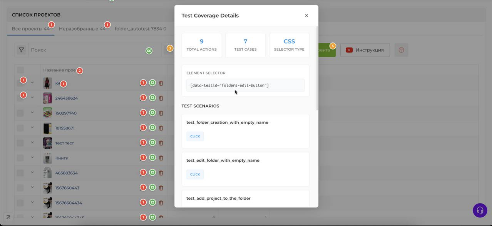
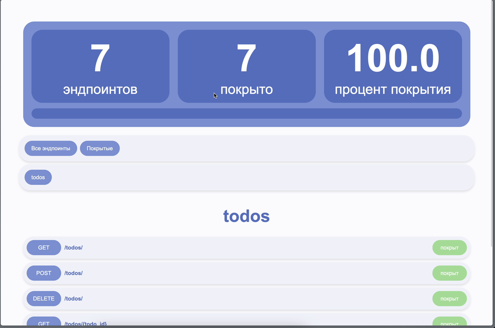
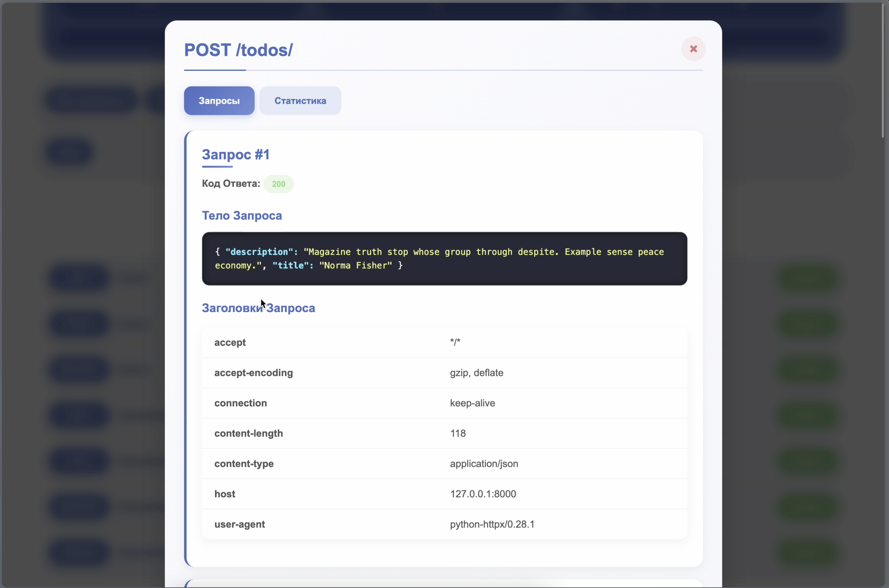

+++
date = '2026-03-31T19:38:29+03:00'
draft = false
title = 'Обо мне'
+++

## Основное 

QA Engineer с 5-летним опытом в автоматизации тестирования. Специализируюсь на внедрении автотестов и оптимизации процессов тестирования. Имею опыт работы в качестве единственного тестировщика так и в качестве QA Lead. Ценю качественное асинхронное взаимодействие в команде, хороший dx, бережливое управление.


## Чуть о том как работаю 


Стараюсь писать автотесты, подключать ручное тестирование как можно раньше начиная с постановки задачи, обсуждая необходимые компоненты, которые понадобятся при написании автотеста, ручном тестировании, для коректной работы фичи. В дальнейшем прогоняя тестовый набор вместе с завершением фичи или фикса бага. Автотесты для фича веток запускаю только для определенного функционала и окружения, чтобы тесты разработчиков проходили быстрее. Очень внимательно слежу за процентом нестабильных тестов, помогаю дорабатывать тесты и функционал для точного прохождения тестов. Ручное тестирование стараюсь проводить только как исследовательское тестирование, но при низком покрытии автотестами, конечно же, возможно и регрессионное тестирование (и связанные с ним виды тестирования). 

Есть опыт в написании и поддержке различных видов автотестов (ui, api, unit). Есть небольшой опыт в разработке бэкенда и фронтенда. 

**UI**

Автотесты писал, в основном на Python используя Playwright, Selene, Selenium + различные точечные библиотеки. Есть небольшой проектный опыт с использованием TS + Playwright и так же Cypress.

Последний год активно использую Playwright + свою небольшую обертку для более питоничного стиля и удобного автоматического логгирования происходящего в Allure, стандартизации шагов и нескольких небольших точечных улучшений. 

Очень простой тест выглядит подобным образом

test_login.py

```python
from ui.components.auth import login_form
from ui.components import header
from ui.components import profile_tab
from ui.helpers import element_with_text
from ui.components.auth import forgot_password
from ui.components.auth import register_form
from ui.core import be
from ui.marks import Pages
from config import Settings
import pytest

@Pages.open_login_page
@pytest.mark.noauth
def test_login(settings: Settings):
    login_form.as_user(username=settings.user_email, password=settings.user_password)
    header.profile_button.should(be.visible)
```

components/auth

```python
from ui.core import Input, Button

email_input = Input(
selector='[data-testid="login-input"]',
description="Введите E-mail",
)
password_input = Input(
selector='[data-testid="password-input"]',
description="Введите Пароль",
)
login_button = Button(selector='[data-testid="login-button"]', description="Войти")
forgot_password_button = Button(
selector="Забыли пароль?",
)
create_account_button = Button(selector="Создать аккаунт")

def as_user(username: str, password: str):
    email_input.type(username)
    password_input.type(password)
    login_button.click()
```

Для оценки покрытия UI автотестами использую <https://github.com/Nikita-Filonov/ui-coverage-tool>, есть свое самописаное расширение, которому можно скормить результаты прогона и отобразить покрытие на странице. 



**API**

Клиенты и DTO автоматически генерирую на основе OpenApi спецификации. Есть опыт тестирования и работы с микросервисной архитектурой от нескольких микросервисов до нескольких десятков микросервисов. Есть свой небольшой клиент над httpx для автоматического логгирования в Allure.

Есть свой self-hosted инструмент для автоматической оценки покрытия API тестами на основе swagger. 




Так же использую в работе https://github.com/Nikita-Filonov/swagger-coverage-tool со своими доработками для более лаконичного синтаксиса.

Очень простой автотест выглядит подобным образом

```python
from clients.http.auth.apis.auth_http_api import AuthApi
from clients.http.auth.apis.session_http_api import SessionApi
from config import Settings
from clients.http.user.apis.users_api import UserApi
from clients.http.auth.models.api_models import AuthLoginDto, SessionAccessCreateDto

def test_auth(
auth_service: AuthApi,
session_service: SessionApi,
user_service: UserApi,
settings: Settings,
):
    auth = auth_service.post_auth_login(
    AuthLoginDto(email=settings.user_email, password=settings.user_password)
    )
    session = session_service.post_auth_sessions_access(
    SessionAccessCreateDto(refreshToken=auth.refresh_token)
    )
    user = user_service.get_user_users_me(
    headers={"authorization": f"Bearer {session.access.token}"},
    tariff_sync_force=False,
    )
    assert user.email == settings.user_email
```

UNIT

Писал юнит автотесты под django, fastapi, с использованием различных инструментов для различных задач.

Будет дополнено. 