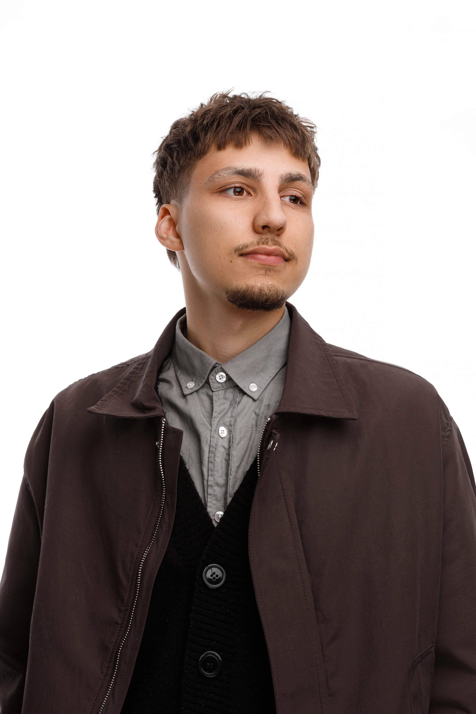

+++
date = '2026-03-31T19:38:29+03:00'
draft = false
title = 'Обо мне'
+++

## Основное 

QA Engineer с 5-летним опытом в автоматизации тестирования. Специализируюсь на внедрении автотестов и оптимизации процессов тестирования. Имею опыт работы в качестве единственного тестировщика так и в качестве QA Lead. Ценю качественное асинхронное взаимодействие в команде, хороший dx, бережливое управление.

## Что использую в работе 

#### Тестирование

**API** httpx, curlify, deepdiff, pydantic, jsonschema, schemathesis, locust и другое. 
**UI** Playwright, Selenium, Selene, Selenoid, Appium
**Общее** pytest + плагины, allure-pytest, django test, faker, factoryboy и другое. 
**TMS** Allure TestOps, TestIT, Qase

#### Бэкенд

Django, DRf, django-ninja, FastAPI, SqlAlchemy, Alembic, PostgreSQL, Celery, Redis, RabbitMQ, Kafka и другое.

#### CI

Gitlab CI, Github Actions

#### Другое

Docker, Rabbit, Kafka, Nginx, Traeffik, dokploy, Bootstrap, html, css, ruff, mypy