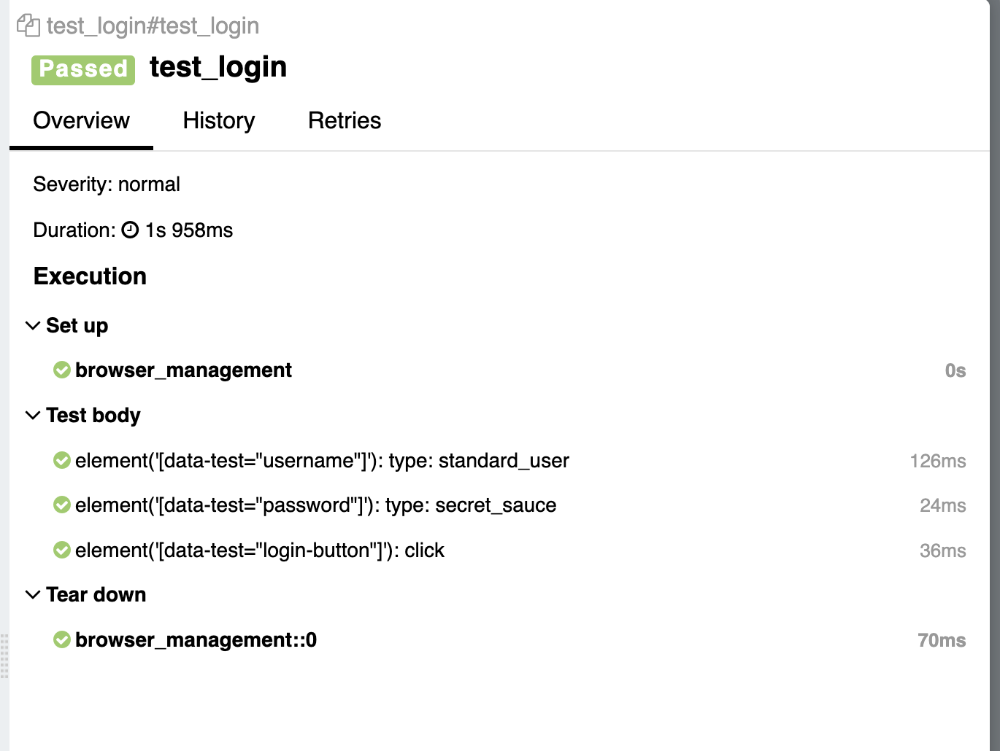

+++
date = '2026-03-29T21:17:52+03:00'
draft = false
title = 'Автоматическое логгирование шагов в Selene'
+++

[Selene](https://github.com/yashaka/selene) - прекрасная библиотека, которая позволяет писать прекрасные автотесты. Ниже представлен рецепт приготовления автоматичесского логгирования шагов в Selene.

## Пилим фикстурку 

```python
import pytest
import allure_commons
from selene import support, browser

@pytest.fixture(autouse=True)
def browser_management():
    browser.config._wait_decorator = support._logging.wait_with(
            context=allure_commons._allure.StepContext
        )
    yield
    browser.quit()
```

## Пишем тест 

```python
from selene.support.shared.jquery_style import s
from selene import browser

def test_login():
    browser.open("https://www.saucedemo.com/")
    s('[data-test="username"]').type("standard_user")
    s('[data-test="password"]').type("secret_sauce")
    s('[data-test="login-button"]').click()
```

## Запускаем 

```bash
pytest --alluredir=allure-results
```

## Наслаждаемся




Будет дополнено. 