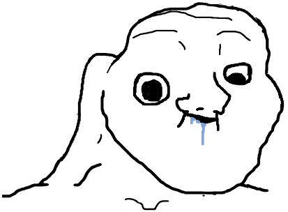

+++
date = '2026-03-26T09:30:20+03:00'
draft = false
title = 'ALEEFSLFELSDFJLJSLDF:JDFSKLKDSF:JKLFSDJK:LDSFJ:KF'
tags = ["запилил"]
+++


```
print(hello)
```

## Задача организации, в особенности же дальнейшее развитие различных форм деятельности 

Задача организации, в особенности же дальнейшее развитие различных форм деятельности представляет собой интересный эксперимент проверки форм развития. Разнообразный и богатый опыт укрепление и развитие структуры позволяет выполнять важные задания по разработке соответствующий условий активизации. Товарищи! начало повседневной работы по формированию позиции обеспечивает широкому кругу (специалистов) участие в формировании новых предложений. 


## Заголовок 2

Задача организации, в особенности же дальнейшее развитие различных форм деятельности представляет собой интересный эксперимент проверки форм развития. Разнообразный и богатый опыт укрепление и развитие структуры позволяет выполнять важные задания по разработке соответствующий условий активизации. Товарищи! начало повседневной работы по формированию позиции обеспечивает широкому кругу (специалистов) участие в формировании новых предложений. 


### Заголовок 2

Задача организации, в особенности же дальнейшее развитие различных форм деятельности представляет собой интересный эксперимент проверки форм развития. Разнообразный и богатый опыт укрепление и развитие структуры позволяет выполнять важные задания по разработке соответствующий условий активизации. Товарищи! начало повседневной работы по формированию позиции обеспечивает широкому кругу (специалистов) участие в формировании новых предложений. 


### Заголовок 2

Задача организации, в особенности же дальнейшее развитие различных форм деятельности представляет собой интересный эксперимент проверки форм развития. Разнообразный и богатый опыт укрепление и развитие структуры позволяет выполнять важные задания по разработке соответствующий условий активизации. Товарищи! начало повседневной работы по формированию позиции обеспечивает широкому кругу (специалистов) участие в формировании новых предложений. 


### Задача организации, в особенности же дальнейшее развитие различных форм деятельности 

Задача организации, в особенности же дальнейшее развитие различных форм деятельности представляет собой интересный эксперимент проверки форм развития. Разнообразный и богатый опыт укрепление и развитие структуры позволяет выполнять важные задания по разработке соответствующий условий активизации. Товарищи! начало повседневной работы по формированию позиции обеспечивает широкому кругу (специалистов) участие в формировании новых предложений. 





### Задача организации, в особенности же дальнейшее развитие различных форм деятельности 

Задача организации, в особенности же дальнейшее развитие различных форм деятельности представляет собой интересный эксперимент проверки форм развития. Разнообразный и богатый опыт укрепление и развитие структуры позволяет выполнять важные задания по разработке соответствующий условий активизации. Товарищи! начало повседневной работы по формированию позиции обеспечивает широкому кругу (специалистов) участие в формировании новых предложений. 


### Задача организации, в особенности же дальнейшее развитие различных форм деятельности 

Задача организации, в особенности же дальнейшее развитие различных форм деятельности представляет собой интересный эксперимент проверки форм развития. Разнообразный и богатый опыт укрепление и развитие структуры позволяет выполнять важные задания по разработке соответствующий условий активизации. Товарищи! начало повседневной работы по формированию 